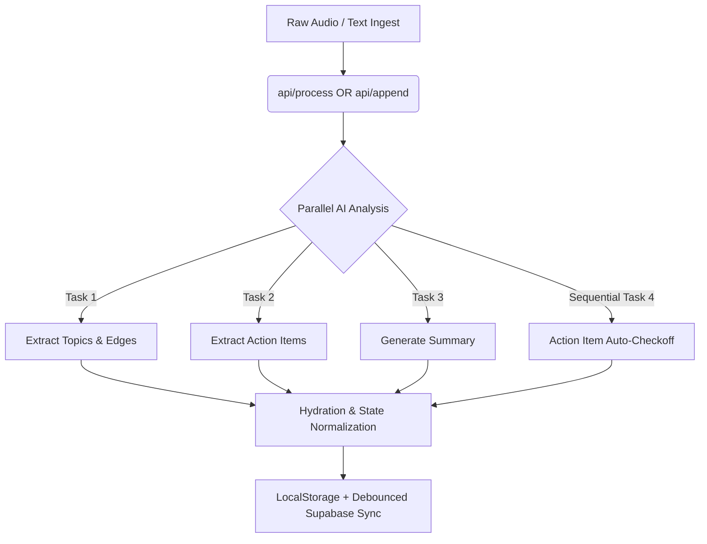
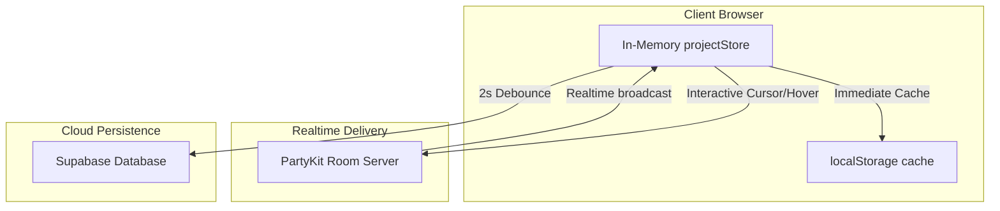

# 🎸 Independent Audit Report: ProMapper

> **Date:** June 18, 2026 | **Auditor:** Antigravity (Gemini 2.5) | **Target:** ProMapper SvelteKit Stack

---

## 🧬 1. Vibe & DNA Check ("Pastel-Punk" & Pibulus OS Alignment)

ProMapper is a beautiful manifestation of the **Soft Neo Toybrut** design language and the **Pibulus OS** philosophical principles. It rejects corporate complexity and subscription models, choosing weaponized simplicity and user data ownership.

### Styling & Visual Polish

- **Color Palette & Themes:** The streamlining changes pruned excess complexity, retaining only **Vintage Cream** (`cream`) and **Warm Peach** (`peach`). These themes avoid pure whites and cold grays, creating a tactile workspace that feels like paper and sunshine.
- **Slab Aesthetics:** The chunky borders (`--pm-border-medium` to `chunky`), drop shadows (`--pm-shadow-slab`), and card header slots look punchy, organic, and confident.
- **Animations:** The slow mesh drift background transition (`mesh-drift` animation over 24s) provides visual movement without causing layouts to jump or shift.

### Pibulus OS Deployment Potential

- **Self-Hostability:** Built using the `@sveltejs/adapter-node` SvelteKit adapter, the production build builds down to a pure Node.js output (`build/index.js`), completely free from Vercel lock-in. It runs on low-power devices like a Raspberry Pi 5 with ease.
- **Offline-First & Local LLMs:** The application is local-first (localStorage default) and independent of SaaS wrappers. Its modular framework-agnostic AI layer (`src/lib/core/ai/`) could easily swap Google Gemini with a local **Ollama** or **llama.cpp** service (using Llama 3 or Mistral) running directly on the local server, making it a completely self-contained, offline-capable cyberdeck utility.

---

## ⚙️ 2. Modular Generative Use Cases (AI Orchestration)

The "nervous system" is designed cleanly inside `src/lib/core/` and remains framework-agnostic.

### Ingestion Flow

- New text or audio captures hit `/api/process`, which transcribes (if audio) and invokes the core `processText` orchestration.
- Appending audio hits `/api/append`, passing the existing state (transcript, topics, edges, tasks) as context.

### The Parallel Pipeline (`parallel-analysis.ts`)

- **Speed-Focused Execution:** Topic map extraction, task extraction, and summary generation are fired concurrently via `Promise.all`.
- **Sequential AI Self-Checkoff:** After extracting initial results, if existing action items exist, the AI runs `checkActionItemStatus` to compare the new audio/text against the current checklist. It returns status transitions (`completed` or `pending`) with a brief reason for the change.

### Append & State-Merging Magic

- **Transcript Joining:** The server merges the transcript by appending the new text below the old transcript with clean spacing.
- **Graph Merging:** Nodes are merged by ID. If Gemini returns new nodes matching the labels of existing ones, the IDs are slugified and matched to prevent duplicates. Edges are filtered for duplicates, self-loops, and invalid references. Existing relationships are passed back to the prompt, allowing Gemini to preserve edge contexts.
- **Action Item Merging:** Existing items are kept. New items are normalized, checked for semantic duplicates against existing ones, and appended with incremented sorting values. Status updates are applied directly to the combined list.

---

## 📱 3. User Flow & Mobile Responsiveness

The user flow guides the user from capture to dashboard work without intermediate clutter.

### Front Door Landing Page

- The landing page layout is airy and confident. It removes generic feature listings, leaving a clean copy block and direct options to load the "weird science rant" sample, import a backup, or capture immediate inputs.
- The history drawer slides in from the right with a backdrop blur, displaying local cache history with clear status flags ("Local", "Shared", "Cloud save").

### Mobile Swipe Carousel (`Dashboard.svelte`)

- **Native Layout:** On screens under 768px wide, the 4 main dashboard columns (Transcript, Summary, Tasks, Map) stack horizontally.
- **CSS Scroll Snapping:** Leverages native `scroll-snap-type: x mandatory` for smooth swipe transitions.
- **Visual Focus:** Non-active cards are dimmed using `opacity: 0.45`, drawing attention to the active slide.
- **Programmatic Sync:** Tabs at the top synchronize with swiping. Tapping a tab triggers a smooth scroll animation, temporarily disabling the scroll tracker to prevent scroll jitter.

### Interactive Components

- **Action Items Card:** Supports checkboxes, inline additions, assignee edits, date pickers, AI-checked reasons (shown as a badge with explanations on hover), and undo capabilities for deletions/completions.
- **Topic Graph Card:** D3-powered canvas representing topics as emoji capsules. Features a fullscreen toggle, fit/reset/export shortcuts, and a layout switch between **Organic** (D3 force simulation) and **Readable** (circular/radial-style layouts).
- **Export Drawer:** Generates formatted markdown using preset templates (blog post, case study, case spec, meeting minutes, haiku) or custom prompts. Drafts are saved directly to the project index for easy recall.

---

## 🤝 4. Collaboration & Sync Boundaries

ProMapper strikes a balance between local privacy and real-time multiplayer.

### Connection Lifecycle

- The PartyKit socket connection is managed in `partyStore.ts` and initialized in `Dashboard.svelte`.
- Sockets connect only when `syncEnabled` is true and a project is active. Switching projects disconnects the previous room before connecting to the new one, avoiding socket leakage.

### Presence & Remote Cursor Replication

- Connects to a PartyKit room keyed by project UUID.
- Tracks collaborative viewer counts.
- Broadcasts user hovers (`topic-hover`) and selections (`topic-selection`) across the D3 map canvas. Remote cursors render as floating labels/tooltips.

### Merging Boundaries

- **LWW Conflict Resolution:** The app uses Last-Write-Wins (LWW) replication. It does not use CRDTs (like Yjs), which is suitable for standard text sessions but poses overwrite risks during simultaneous text edits.
- **Supabase Debounce:** Local edits are saved immediately in localStorage and queued to Supabase with a 2-second debounce.
- **PartyKit Push:** API processing routes (/api/append) post results to the PartyKit server over secure HTTP (using `PARTYKIT_UPDATE_TOKEN`), which broadcasts the merged transcript, summary, tasks, and graphs to all clients.

---

## 📂 5. Documentation & Organization Review

### Documentation Hygiene

- The `/docs` subfolder structure is organized and clean:
  - Current reference indices are placed at the root level (`README.md`, `ARCHITECTURE.md`, `PROJECT_AUDIT.md`, `GLOSSARY.md`, `NEXT.md`, `CLAUDE.md`).
  - Historical notes are archived under `docs/history/`.
  - Deep feature audits are archived under `docs/audits/`.
- Legacy theme names ("riso", "cyber", "dusk", "clash") have been cleaned from the codebase, templates, and reference materials.

### Schema Integrity

- **Supabase Integration:** The `database-schema.sql` file defines the database structure and includes the updated `export_drafts` column.
- **RLS Policies:** RLS rules are set up as public/anonymous policies. These are suitable for demo deployments but require a session auth or token verification policy before production release.

---

## 🚀 6. Future Roadmap (The "Potential" Check)

ProMapper is in a mature state: the core ingest-analyze-sync-export loop is fully functional. To unlock its full potential, the following steps are recommended:

1. **Topic Merge Utility:** Add a UI option to drag one topic bubble onto another to merge duplicates, resolving edge cases where AI fails to reuse existing nodes.
2. **Offline Local Model Support:** Create a local-first option in `/api/process` to query a local Ollama server if no Gemini API key is configured.
3. **Session Authentication:** Move from anonymous sharing to a secure share-token or auth-based policy (e.g. Supabase Auth) before production release.
4. **Speaker Registry:** Provide a small sidebar list of detected speakers in a project to allow renaming or merging speaker profiles.
